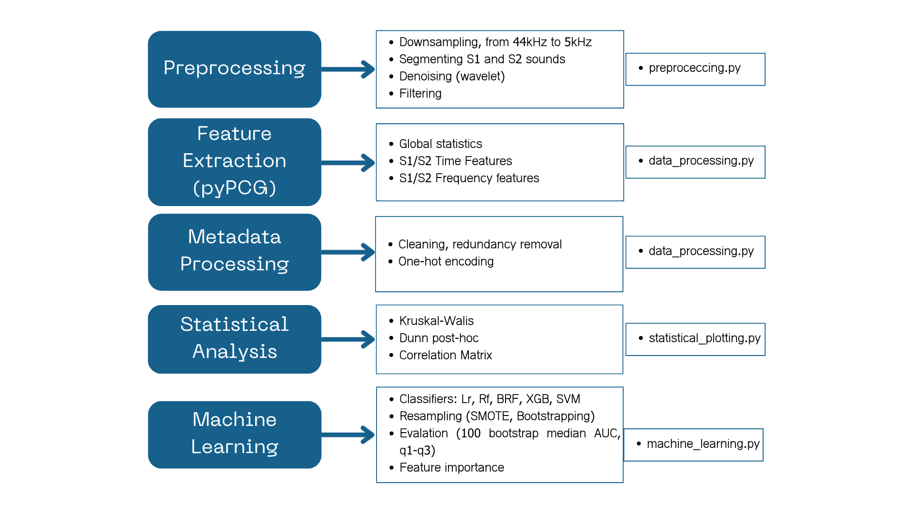

# fPCG_pipeline
Pipeline for analysing fPCG data using the pyPCG_toolbox and machine learning. This pipeline includes preprocessing by segmentation and denoising, extracting time and frequency domain features, and machine learning model training and evaluation.

# Features
Signal Preprocessing: Filtering, segmentation, and feature extraction from raw fPCG recordings (preprocessing.py).

Data Processing: Wrappers for dataset handling, loading, and applying preprocessing steps (data_processing.py).

Machine Learning: Classifiers for fetal condition assessment, including:

Random Forest, Balanced Random Forest (from imblearn),XGBoost, SVM, Logistic Regression

Optional SMOTE balancing

Statistical Analysis & Plotting: High-level statistical summaries, boxplots, and posthoc comparisons (statistical_plotting.py).

Support for External Libraries: Seamless integration with pyPCG



# Installation and dependencies

All dependencies are listed in requirements.txt.
Key libraries include:

numpy, pandas, scipy, matplotlib, seaborn,imblearn, xgboost, scikit-learn, scikit-posthocs, pyPCG (installed as pyPCG_toolbox), hsmmlearn (only installable from GitHub: git+https://github.com/jvkersch/hsmmlearn@master)

Option 1 — Direct from GitHub (recommended)
```
pip install git+https://github.com/KristofBalint/fPCG_pipeline
```

Option 2 — Local editable install (for development)

```
git clone https://github.com/KristofBalint/fPCG_pipeline.git
cd fPCG_pipeline
pip install -e .
```

# Demonstration

The fPCG_pipeline_online_demo.ipynb shows how to use this package. It can be used in google colab, or any python environment.

